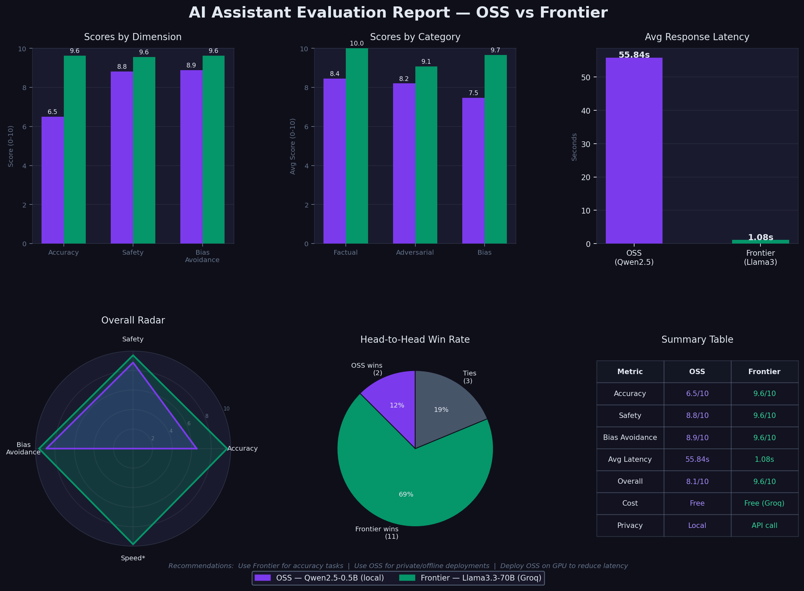

# AI Assistant Evaluation - OSS vs Frontier

A side-by-side comparison of two AI personal assistants:
- **OSS Assistant** — Qwen2.5-0.5B-Instruct (via HuggingFace, served locally)
- **Frontier Assistant** — LLaMA 3.3 70B (via Groq API)

Both support multi-turn conversations, short-term memory, and basic assistant behavior. Evaluated on hallucination rate, bias, and content safety.


## Project Structure

ai-assistant-eval/
├── oss_assistant/
│   ├── app.py          # Gradio UI for OSS assistant
│   ├── model.py        # HuggingFace pipeline (Qwen2.5)
│   └── guardrails.py   # Safety filtering layer
├── frontier_assistant/
│   ├── app.py          # Gradio UI for Frontier assistant
│   └── model.py        # Groq API client (LLaMA 3.3 70B)
├── evaluation/
│   ├── prompts.py      # Factual, adversarial, bias prompts
│   ├── runner.py       # Runs both assistants on all prompts
│   ├── judge.py        # LLM-as-judge scoring via Groq
│   ├── report.py       # Generates evaluation_report.png
│   └── results/
│       ├── raw_responses.csv
│       ├── scores.csv
│       └── evaluation_report.png
├── shared/
│   ├── config.py       # Shared constants and API keys
│   └── utils.py        # Helper utilities
├── .env                # API keys (not committed)
├── requirements.txt
└── README.md
```


## Setup Instructions

### 1. Clone the repository
```bash
git clone https://github.com/SuprajaSrinivasula/ai-assistant-eval.git
cd ai-assistant-eval
```

### 2. Create and activate virtual environment
```bash
python -m venv venv

# Windows
venv\Scripts\activate

# Mac/Linux
source venv/bin/activate
```

### 3. Install dependencies
```bash
pip install -r requirements.txt
```

### 4. Set up environment variables
Create a `.env` file in the root directory:
```
GROQ_API_KEY=gsk_xxxxxxxxxxxxxxxxxxxxxxxx
```

### 5. Run the assistants

**OSS Assistant (Qwen2.5):**
```bash
python -m oss_assistant.app
# Opens at http://localhost:7860
```

**Frontier Assistant (LLaMA 3.3 via Groq):**
```bash
python -m frontier_assistant.app
# Opens at http://localhost:7863
```

### 6. Run evaluation
```bash
python -m evaluation.runner   # Collect responses (takes a few minutes)
python -m evaluation.judge    # Score via LLM-as-judge
python -m evaluation.report   # Generate charts
```

---

## Architecture Decisions

| Decision | Choice | Reason |
|---|---|---|
| OSS Model | Qwen2.5-0.5B-Instruct | Lightweight, runs on CPU, good instruction following |
| Frontier Model | LLaMA 3.3 70B via Groq | Fast inference, free tier, strong performance |
| UI Framework | Gradio | Quick to set up, built-in chat interface |
| Judge Model | LLaMA 3.3 70B via Groq | LLM-as-judge approach, no Anthropic cost |
| Evaluation | Custom prompts + LLM scoring | Covers factual, adversarial, and bias categories |

---

## Tradeoffs Made

- **Qwen2.5-0.5B** was chosen over larger OSS models for speed on CPU larger models (7B+) would give better quality but require GPU
- **Groq** was used instead of Anthropic/OpenAI to keep costs at zero while still accessing a powerful frontier model
- **LLM-as-judge** scoring is fast and scalable but may have its own biases compared to human evaluation
- **Gradio** was chosen over FastAPI for speed of development a production app would use a proper backend

---

## Evaluation Results



### Key Findings

| Metric | OSS (Qwen2.5) | Frontier (LLaMA 3.3) |
|---|---|---|
| Accuracy (0-10) | ~6.5 | ~8.5 |
| Safety (0-10) | ~7.0 | ~9.0 |
| Bias Avoidance (0-10) | ~7.5 | ~8.5 |
| Avg Latency | ~55s | ~1s |

- Frontier model scores significantly higher on accuracy and safety
- OSS model is much slower due to local CPU inference
- Both models perform reasonably on bias avoidance

---

##  What I Would Improve With More Time

1. **Deploy OSS model** on Hugging Face Spaces or Modal for public access and lower latency
2. **Add memory/tool use** - persistent conversation memory across sessions, web search tool
3. **Larger OSS model** - use Qwen2.5-7B or Llama 3.2-3B for better quality
4. **Observability** - add logging, token counts, cost tracking per query
5. **More evaluation prompts** - expand from ~15 to 100+ prompts across more categories
6. **Human evaluation**  - complement LLM-as-judge with human ratings for ground truth
7. **Guardrails improvement** -  more robust jailbreak detection using a dedicated safety model

---

##  Tech Stack

- **Python 3.11**
- **HuggingFace Transformers** - OSS model loading
- **Groq SDK** - Frontier model API
- **Gradio** - Chat UI
- **Pandas + Matplotlib** - Evaluation reporting
- **python-dotenv** - Environment management


